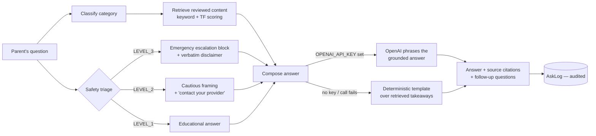

<div align="center">

# 🪺 NestWise

### Every Parent Learns. Every Day.

**Guiding families through pregnancy, childbirth, and early parenting with personalized learning.**

One calm, structured learning platform for the journey from a positive test to a three‑year‑old —
lessons, quizzes, spaced‑repetition review, illustrated activities, and a retrieval‑grounded AI
tutor that always knows your stage.

<br/>


</div>

> [!IMPORTANT]
> NestWise provides **educational information and decision support — not medical diagnosis or
> emergency care.** It is not an emergency service. Health copy in this repo is
> **evidence‑informed scaffolding structured for clinical review**, never invented authoritative
> advice. The safety framing, escalation wording, and source citations are the real, load‑bearing
> parts.

---

## The problem

New and expecting parents don't lack information — they're **drowning** in it. It's scattered
across forums, 40 open tabs, and contradictory blog posts; it's written for the average pregnancy,
not *yours*; and at 2 a.m. it's impossible to tell reassurance from a red flag. There's no sense of
*progress* — no feeling that you're actually **learning** this, day by day.

## The solution

NestWise treats early parenthood as a **course you move through**, not a search box you panic into.

- **It knows where you are.** Enter a due date or a birthday; the entire app — dashboard,
  navigation, lessons, nutrition, activities — reshapes around your pregnancy week or your child's
  age, and updates itself as time passes.
- **It has a real learning loop.** Read → check understanding → get quizzed adaptively → explain it
  back in your own words → keep it with spaced repetition. (Details below — this is the part we're
  proudest of.)
- **Its AI tutor can't make things up.** Every answer is retrieved from reviewed content, cites its
  sources, and routes anything urgent to real help — *by design*, not by prompt‑politeness.
- **It stays calm.** A warm hand‑drawn "sketchbook" interface, a "Listen" button on every lesson,
  and a one‑tap **Kids Mode** that strips the UI down to games for a toddler.

---

## 🌟 What makes it stand out

### 1. A complete learning loop — not just articles

Most "learning" apps stop at content. NestWise closes the loop:

```
Rich lesson  ─▶  Module quiz        ─▶  "Quiz me" (adaptive, pick your topics)
   │                  │                        │
   ▼                  ▼                        ▼
"Explain           Missed a          "Test me" (Socratic: it asks, you
 differently"       question?          answer in prose, it grades you)
 (simpler /            │                        │
  example /            ▼                        ▼
  for my           ┌──────────────────────────────────┐
  situation)  ────▶│   Daily Review — Leitner ladder   │◀──── Flashcards
                   │   boxes 1–5, "what's due today"   │      (auto‑made from
                   └──────────────────────────────────┘       lesson takeaways)
                                    │
                                    ▼
                     Knowledge map on /progress
                     (per‑module: New · Learning · Strong)
```

Every wrong quiz answer and every flagged flashcard flows into **one** spaced‑repetition queue
(`src/lib/review.ts`) — get it right, it moves to a longer interval; get it wrong, it comes back
tomorrow. No decks to manage, just *"what's due today."*

### 2. Ask NestWise — retrieval‑first, safety‑first

A RAG tutor that is **useful with or without an API key**, and safe either way.



- **Grounded.** The model is instructed to answer *only* from retrieved context and to say "I don't
  have reviewed material on that" rather than guess.
- **Escalating.** `classifySafety()` is deliberately conservative — overlapping urgent signals
  escalate. LEVEL_3 questions get a prominent "seek immediate help" block **before** any content.
- **Degrades gracefully.** Pull the API key and it still answers, just phrased by a template.
- **Answer styles**: *Explain simply · Standard · Go deeper.* **Test me** flips it into Socratic
  mode. Every Q&A is written to an `AskLog` audit table.

### 3. One codebase, three journeys, that morph in place

`getFamilyStage()` resolves the family to **Pregnancy → Birth & Postpartum → Child & family**, and
a header **journey switcher** lets you jump ahead or back at any time. Nav sets, dashboards,
content filters, and even allowed routes all derive from that one resolved stage.

### 4. Accessibility & calm as features

Hand‑drawn sketchbook design system (paper palette, wobble‑border UI kit) · **Listen** text‑to‑speech
on lessons with a soft voice · gently animated hand‑drawn exercise figures · **Kids Mode** cookie
that swaps the whole shell for a toddler‑safe game launcher · reduced‑motion aware · 44px targets ·
semantic headings · every illustration captioned.

### 5. Built to be trusted

Content lives in the **database**, not JSX — reviewable and updatable without touching the UI. Every
health entry carries a `source` and renders a citation badge. Full **data export** and
**account / child deletion** in Settings. No free‑text medical history is ever stored.

---

## 📊 By the numbers

| | |
|---|---:|
| Curated content entries (lessons, weeks, symptoms, foods, exercises, facts, dev stages) | **254** |
| Learning modules · module quizzes | **16 · 19** |
| Parent‑led activities · picture‑based learning games · family games | **28 · 18 · 12** |
| Prisma models | **21** |
| Feature sections in the app | **19** |
| Unit + integration tests (Vitest) | **48 passing** |
| API keys required to run the full product | **0** |

---

## 🧱 Tech stack

| Layer | Choice |
|---|---|
| Framework | **Next.js 15** (App Router, Server Actions), **React 19**, **TypeScript** (strict) |
| Styling | **Tailwind CSS v4** — custom hand‑drawn "sketchbook" theme, light/dark tokens |
| Database | **PostgreSQL** + **Prisma** (21 models, cascade deletes for full data removal) |
| Auth | **Auth.js v5** (NextAuth) — Credentials provider, bcrypt, role‑aware views |
| AI | **OpenAI API** (`OPENAI_MODEL`, default `gpt-4o-mini`) behind a swappable `llm.ts` layer, with a deterministic RAG fallback + 3‑tier safety classifier |
| Validation | **Zod** on every Server Action and route handler |
| Charts | **Recharts** (progress) · **framer‑motion** (reduced‑motion gated) |
| Tests | **Vitest** (unit + integration) · **Playwright** (E2E journeys) |

---

## 🚀 Quick start

```bash
# 1. Environment
cp .env.example .env          # set DATABASE_URL + AUTH_SECRET (OPENAI_API_KEY optional)

# 2. Database  (docker-compose.yml provides Postgres, or point DATABASE_URL at your own)
docker compose up -d db
npm install
npm run db:push               # apply the Prisma schema
npm run seed                  # load curated content + a demo account

# 3. Run
npm run dev                   # → http://localhost:3000
```

**Demo login:** `demo@nestwise.test` · `nestwise123`
*(seeded ~18 weeks pregnant, vegetarian, peanut allergy — so filtering and personalization are visible immediately)*

**Turn on the live AI tutor:** add `OPENAI_API_KEY` to `.env` (needs credit at
platform.openai.com — a ChatGPT Plus/Pro subscription does **not** include API access), optionally
set `OPENAI_MODEL="gpt-4o"`, and restart. Without a key, Ask NestWise still works — grounded in
curated content, phrased by a template.

---

## 🎬 2‑minute judge walkthrough

1. **Sign up** → onboarding wizard → *"I'm expecting"* → enter a due date. Watch the dashboard land
   on the correct week with *"≈ N months."*
2. **Learn** → open a module → a lesson. Hit **Listen**. Highlight a paragraph → **Explain
   differently → For my situation.** Scroll to the quiz, miss one on purpose.
3. **Quizzes → Daily review** — the one you missed is already queued for spaced repetition.
4. **Ask NestWise** → *"which foods are high in iron?"* → grounded answer + citations. Then try
   *"I have heavy bleeding and cramping"* → **LEVEL_3 emergency escalation** appears first.
5. **Ask NestWise → Test me** → answer its question in prose → get Socratic feedback.
6. **Settings → add a child's birthday** → the whole app (nav, dashboard, content) flips to
   **Child & family**. Open **Games**, then tap **Kids Mode**.
7. **Progress** → the knowledge map shows New / Learning / Strong per module.

---

## 🗂️ Project structure

```
prisma/
  schema.prisma            21 models: families, content, quizzes, games, progress, review, audit
  seed.ts                  loads src/content/** into the DB (prunes stale rows)
src/
  app/
    page.tsx               landing
    (auth)                 login / signup
    onboarding/            stage‑aware setup wizard
    (app)/                 authenticated, stage‑aware shell
      home  journey  learn  quiz  nutrition  exercise  symptoms
      ask  flashcards  progress  bookmarks  search  settings
      birth/…  postpartum/…  child/{timeline,activities,games,family-games,journal,routines}
    api/{ask,search,export,auth}
  lib/
    ai/          answer · retrieve · llm · socratic · rephrase        (Ask NestWise pipeline)
    safety/      classify · constants                                 (3‑tier triage + wording)
    personalization/  stage · pregnancy · age · recommend · mode-override
    review.ts    Leitner spaced‑repetition ladder
    flashcards.ts  mastery.ts  kids-mode.ts
  content/       typed, reviewable source of truth (loaded into the DB by seed)
  components/    ui/ (sketchbook kit) · nav/ · safety/ · child/ · games/
tests/           unit/ · integration/ · e2e/
```

---

## 🧪 Testing

```bash
npm test           # Vitest — 48 unit + integration tests
npm run test:e2e   # Playwright — end‑to‑end journeys (needs a seeded DB)
npm run typecheck  # tsc --noEmit
npm run build      # production build
```

Coverage highlights: pregnancy‑week ↔ month math, child‑age stage resolution, quiz scoring,
**safety classifier routing (L1/L2/L3)**, allergen exclusion in nutrition filtering, kid‑mode
route guard, spaced‑repetition scheduling, the game engine (including *"options are always
label‑unique"*), and the manual journey‑switch resolver.

---

## 🛣️ Roadmap

- Clinical content review to lift entries from *scaffolding* to *reviewed*
- `pgvector` semantic retrieval (keyword + TF today)
- Real push / email delivery for the reminder preferences already in the UI
- Partner accounts sharing one family
- Multi‑locale content (copy is centralized; `en` ships)

---

## 📄 Scope & honesty note

Built for a hackathon as a **complete, working feature surface** — every screen, journey, and the
full learning loop function end to end. Educational copy is deliberately labelled placeholder and
structured for expert review; the engineering (personalization, retrieval, safety triage, spaced
repetition, data ownership) is the real deliverable.

<div align="center"><sub>Made with 🪺 for families who are learning something huge, one day at a time.</sub></div>
