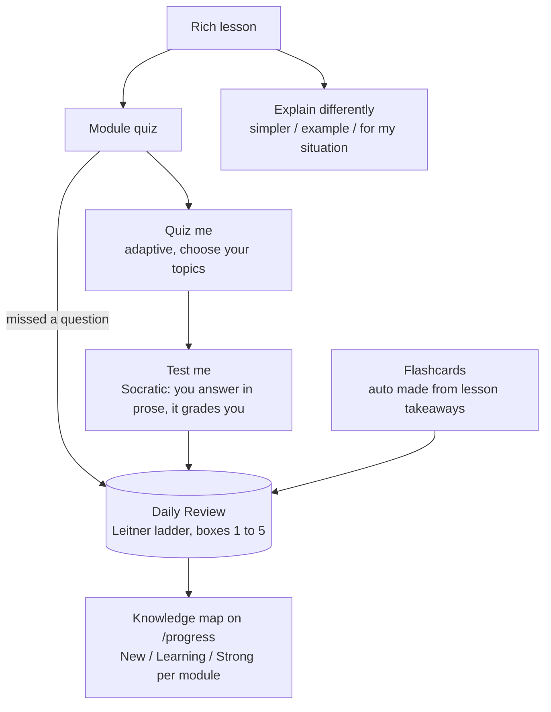
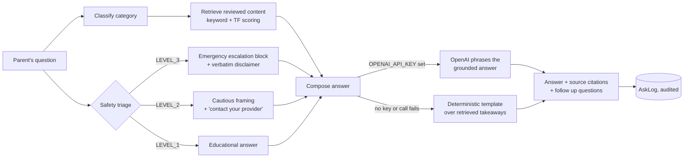

<div align="center">

# 🪺 NestWise

### Every Parent Learns. Every Day.

**Guiding families through pregnancy, childbirth, and early parenting with personalized learning.**

One calm, structured learning platform for the journey from a positive test to a three year old:
lessons, quizzes, spaced repetition review, illustrated activities, and a retrieval grounded AI
tutor that always knows your stage.

<br/>


</div>

---

## The problem

New and expecting parents do not lack information. They are **drowning** in it. It is scattered
across forums, forty open tabs, and contradictory blog posts. It is written for the average
pregnancy, not *yours*. And at 2 a.m. it is impossible to tell reassurance from a red flag. There
is no sense of *progress*, no feeling that you are actually **learning** this, day by day.

## The solution

NestWise treats early parenthood as a **course you move through**, not a search box you panic into.

- **It knows where you are.** Enter a due date or a birthday, and the whole app (dashboard,
  navigation, lessons, nutrition, activities) reshapes around your pregnancy week or your child's
  age, and keeps updating itself as time passes.
- **It has a real learning loop.** Read, check understanding, get quizzed adaptively, explain it
  back in your own words, then keep it with spaced repetition.
- **Its AI tutor cannot make things up.** Every answer is retrieved from reviewed content, cites
  its sources, and routes anything urgent to real help by design, not by prompt politeness.
- **It stays calm.** A warm hand drawn "sketchbook" interface, a "Listen" button on every lesson,
  and a one tap **Kids Mode** that strips the UI down to games for a toddler.

---

## The learning loop

Most learning apps stop at content. NestWise closes the loop.



Every wrong quiz answer and every flagged flashcard flows into **one** spaced repetition queue
(`src/lib/review.ts`). Get it right and it moves to a longer interval. Get it wrong and it comes
back tomorrow. No decks to manage, just *what is due today*.

Pieces of the loop:

| Step | What it does |
|---|---|
| **Rich lessons** | 16 modules, roughly 48 lessons. Each has a full explanation, a "why it matters" section, practical tips, what to avoid, a short related video, and links to related lessons. |
| **Module quiz** | 6 to 7 questions per module, with an instant explanation on every answer. |
| **Quiz me** | Build an adaptive quiz on the topics you choose. Difficulty tracks your score. |
| **Test me (Socratic)** | Ask NestWise poses a question, you answer in prose, and it grades your understanding against a model answer. |
| **Explain differently** | Highlight any lesson paragraph and have it re explained: plainer language, one everyday example, or tailored to your situation. |
| **Flashcards** | Generated automatically from lesson takeaways, folded into the same review queue. |
| **Daily Review** | A Leitner ladder, boxes 1 to 5, surfacing only what is due today. |
| **Knowledge map** | `/progress` shows a New / Learning / Strong band per module. |

---

## Ask NestWise: retrieval first, safety first

A retrieval augmented tutor that is useful **with or without an API key**, and safe either way.



- **Grounded.** The model is instructed to answer *only* from retrieved context, and to say "I do
  not have reviewed material on that" rather than guess.
- **Escalating.** `classifySafety()` is deliberately conservative: overlapping urgent signals
  escalate. LEVEL_3 questions get a prominent "seek immediate help" block *before* any content.
- **Degrades gracefully.** Remove the API key and it still answers, phrased by a deterministic
  template over the retrieved takeaways.
- **Answer styles:** Explain simply, Standard, Go deeper. **Test me** flips it into Socratic mode.
  Every exchange is written to an `AskLog` audit table.

---

## One codebase, three journeys

`getFamilyStage()` resolves the family to one of **Pregnancy**, **Birth and Postpartum**, or
**Child and family**. A header **journey switcher** lets you jump ahead or back at any time.
Navigation sets, dashboards, content filters, and even the routes a profile is allowed to open all
derive from that single resolved stage.

| Journey | What it holds |
|---|---|
| **Pregnancy** | Week by week timeline, trimester aware nutrition (filtered by diet and allergies), symptom explorer, movement library with animated figures. |
| **Birth and Postpartum** | Countdown mode, hospital bag checklists, labor education, recovery and wellbeing topics. |
| **Child and family** | Month by month development for year one, then Age 1 to 2 and Age 2 to 3, plus parent led activities, picture based learning games, family games, milestone journal, and routines. |

---

## Accessibility and inclusion

Accessibility was a design constraint from the start, not a retrofit. A parent may be moving
through pregnancy or life with a newborn while also managing low vision, chronic pain, fatigue, a
learning difference, or limited mobility. NestWise is built so none of that stands between her and
the learning.

### Listen on every lesson

Every lesson has a **Listen** button (`src/components/ui/ListenButton.tsx`) that reads the full
lesson aloud in a soft voice, split into natural chunks so no sentence is dropped by the speech
engine. It needs no account, no download, and no extra data connection. A mother who is blind or
has low vision, who finds long reading painful, who is resting with her eyes closed, or who is
holding a baby with both hands still receives the entire lesson, hands free.

### Designed for a range of needs

| Situation | How NestWise responds |
|---|---|
| Blindness or low vision | Listen reads any lesson aloud; semantic headings and ARIA landmarks for screen readers; a skip to content link; relative units so browser zoom works cleanly |
| Reading fatigue, dyslexia, low literacy, or English as a second language | Any lesson can be heard instead of read; **Explain differently** rewrites a highlighted passage in plainer language or as a concrete example |
| Limited mobility or one handed use (late pregnancy, or while carrying a baby) | Listen is fully hands free; 44px minimum touch targets; the whole app is keyboard operable |
| Vestibular disorders, migraine, motion sensitivity | Honours `prefers-reduced-motion`; animation is gated and there is no autoplaying video |
| Sensory overload, anxiety, postpartum overwhelm | Calm sketchbook visuals, light and dark themes, status never signalled by colour alone, nothing flashing or interrupting |
| High cognitive load | One clear next action per screen; **Kids Mode** strips the shell down to a toddler safe game launcher |

### Baseline

Semantic HTML and heading order, visible focus rings, `aria` labels and `aria-current` state,
captions or alt text on every illustration, high contrast graphite ink on warm paper with a full
dark theme, and a persistent skip to content link.

---

## Data ownership and trust

- Content lives in the **database**, not in JSX, so it can be reviewed and updated without touching
  the UI.
- Every health entry carries a `source` and renders a citation badge.
- Full **data export** and **account and child deletion** in Settings.
- No free text medical history is ever stored.

---

## By the numbers

| Metric | Count |
|---|---:|
| Curated content entries (lessons, weeks, symptoms, foods, exercises, facts, dev stages) | **254** |
| Learning modules and module quizzes | **16 and 19** |
| Parent led activities, picture based learning games, family games | **28, 18, 12** |
| Prisma models | **21** |
| Feature sections in the app | **19** |
| Unit and integration tests (Vitest) | **48 passing** |
| API keys required to run the full product | **0** |

---

## Tech stack

| Layer | Choice |
|---|---|
| Framework | **Next.js 15** (App Router, Server Actions), **React 19**, **TypeScript** (strict) |
| Styling | **Tailwind CSS v4**, custom hand drawn "sketchbook" theme, light and dark tokens |
| Database | **PostgreSQL** with **Prisma** (21 models, cascade deletes for full data removal) |
| Auth | **Auth.js v5** (NextAuth), Credentials provider, bcrypt, role aware views |
| AI | **OpenAI API** (`OPENAI_MODEL`, default `gpt-4o-mini`) behind a swappable `llm.ts` layer, with a deterministic RAG fallback and a 3 tier safety classifier |
| Validation | **Zod** on every Server Action and route handler |
| Charts | **Recharts** for progress, **framer-motion** (gated on reduced motion) |
| Tests | **Vitest** (unit and integration), **Playwright** (end to end journeys) |

---

## Quick start

```bash
# 1. Environment
cp .env.example .env          # set DATABASE_URL and AUTH_SECRET (OPENAI_API_KEY is optional)

# 2. Database (docker-compose.yml provides Postgres, or point DATABASE_URL at your own)
docker compose up -d db
npm install
npm run db:push               # apply the Prisma schema
npm run seed                  # load curated content and a demo account

# 3. Run
npm run dev                   # http://localhost:3000
```

**Demo login:** `demo@nestwise.test` / `nestwise123`
*(seeded around 18 weeks pregnant, vegetarian, peanut allergy, so filtering and personalization
are visible immediately)*

**Turn on the live AI tutor:** add `OPENAI_API_KEY` to `.env` (it needs credit at
platform.openai.com; a ChatGPT Plus or Pro subscription does **not** include API access),
optionally set `OPENAI_MODEL="gpt-4o"`, then restart. Without a key, Ask NestWise still works,
grounded in curated content and phrased by a template.

---

## Deploy (free)

The app runs on a free **Vercel** + **Neon Postgres** pair. No credit card, no time limit.

### 1. Create the database (Neon)

1. Sign up at [neon.tech](https://neon.tech) and create a project.
2. Copy both connection strings it shows:
   - **Pooled** (host contains `-pooler`)
   - **Direct** (no `-pooler`)

### 2. Load schema and content (once, from your machine)

This writes only to the new Neon database; your local database is untouched.

```bash
DATABASE_URL="<neon-direct-url>" DIRECT_URL="<neon-direct-url>" npx prisma db push
DATABASE_URL="<neon-direct-url>" DIRECT_URL="<neon-direct-url>" npm run seed
```

### 3. Deploy the app (Vercel)

1. [vercel.com](https://vercel.com) → **Add New → Project** → import this repo. It auto-detects
   Next.js and uses `vercel.json` (`prisma generate && next build`).
2. Add environment variables:

   | Name | Value |
   |---|---|
   | `DATABASE_URL` | Neon **pooled** string |
   | `DIRECT_URL` | Neon **direct** string |
   | `AUTH_SECRET` | output of `openssl rand -base64 32` |
   | `AUTH_TRUST_HOST` | `true` |
   | `NEXTAUTH_URL` | your `https://<project>.vercel.app` URL (add after the first deploy, then redeploy) |
   | `OPENAI_API_KEY` / `OPENAI_MODEL` | optional |

3. Deploy, then open the URL. Log in with the demo account or sign up.

### Known free-tier limits

- Neon suspends after a few minutes idle; the next request has a short cold start.
- Milestone-journal photo uploads use local disk, which is ephemeral on Vercel. Everything else
  persists in Neon. Move uploads to Vercel Blob (free allowance) for durability.

---

## Guided tour

1. **Sign up**, run the onboarding wizard, choose *"I'm expecting"*, and enter a due date. The
   dashboard lands on the correct week with *"approximately N months."*
2. **Learn**, open a module, then a lesson. Hit **Listen**. Highlight a paragraph and choose
   **Explain differently, For my situation**. Scroll to the quiz and miss one on purpose.
3. **Quizzes, Daily review**: the question you missed is already queued for spaced repetition.
4. **Ask NestWise**: *"which foods are high in iron?"* returns a grounded answer with citations.
   Then ask *"I have heavy bleeding and cramping"* and the **LEVEL_3 emergency escalation** appears
   first, before any content.
5. **Ask NestWise, Test me**: answer its question in prose and get Socratic feedback.
6. **Settings, add a child's birthday**: the whole app (navigation, dashboard, content) flips to
   **Child and family**. Open **Games**, then tap **Kids Mode**.
7. **Progress**: the knowledge map shows New, Learning, or Strong per module.

---

## Project structure

```
prisma/
  schema.prisma            21 models: families, content, quizzes, games, progress, review, audit
  seed.ts                  loads src/content/** into the DB (prunes stale rows)
src/
  app/
    page.tsx               landing
    (auth)                 login, signup
    onboarding/            stage aware setup wizard
    (app)/                 authenticated, stage aware shell
      home  journey  learn  quiz  nutrition  exercise  symptoms
      ask  flashcards  progress  bookmarks  search  settings
      birth/  postpartum/  child/{timeline,activities,games,family-games,journal,routines}
    api/{ask,search,export,auth}
  lib/
    ai/          answer, retrieve, llm, socratic, rephrase       (Ask NestWise pipeline)
    safety/      classify, constants                             (3 tier triage and wording)
    personalization/  stage, pregnancy, age, recommend, mode-override
    review.ts    Leitner spaced repetition ladder
    flashcards.ts  mastery.ts  kids-mode.ts
  content/       typed, reviewable source of truth (loaded into the DB by seed)
  components/    ui/ (sketchbook kit), nav/, safety/, child/, games/
tests/           unit/, integration/, e2e/
```

---

## Testing

```bash
npm test           # Vitest: 48 unit and integration tests
npm run test:e2e   # Playwright: end to end journeys (needs a seeded DB)
npm run typecheck  # tsc --noEmit
npm run build      # production build
```

Coverage highlights: pregnancy week to month math, child age stage resolution, quiz scoring,
**safety classifier routing (L1, L2, L3)**, allergen exclusion in nutrition filtering, the kid
mode route guard, spaced repetition scheduling, the game engine (including "options are always
label unique"), and the manual journey switch resolver.

---

## Roadmap

- Clinical content review to lift entries from scaffolding to reviewed.
- `pgvector` semantic retrieval (keyword and TF scoring today).
- Real push and email delivery for the reminder preferences already in the UI.
- Partner accounts sharing one family.
- Multi locale content (copy is centralized; `en` ships).

---

## Author

**Ancy Patel**
